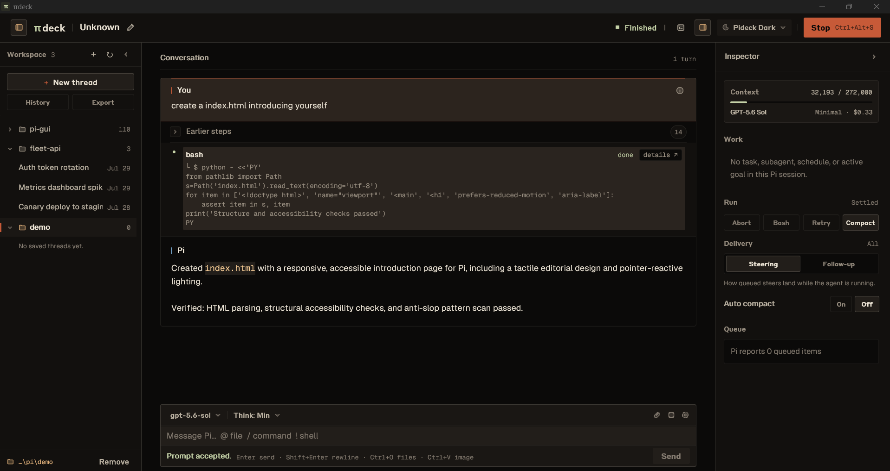
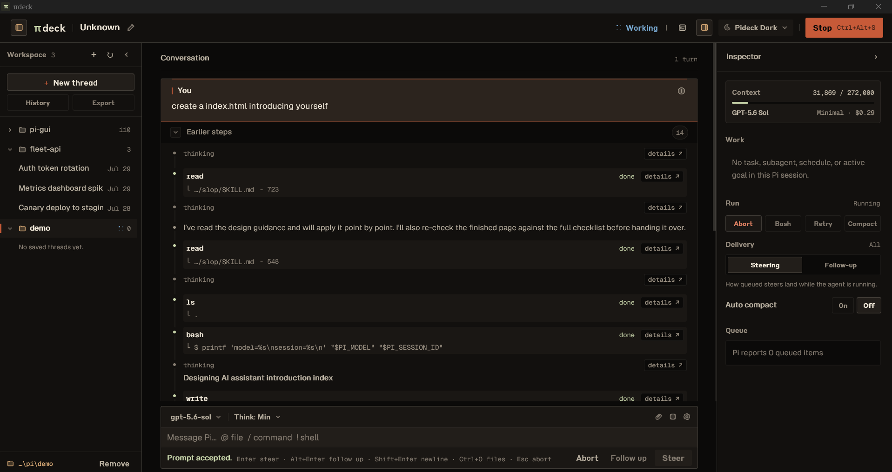
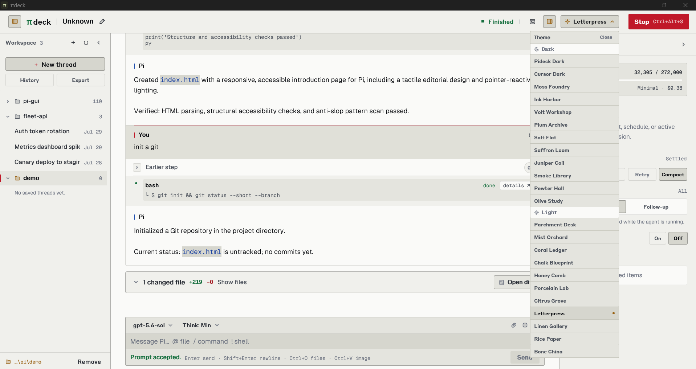
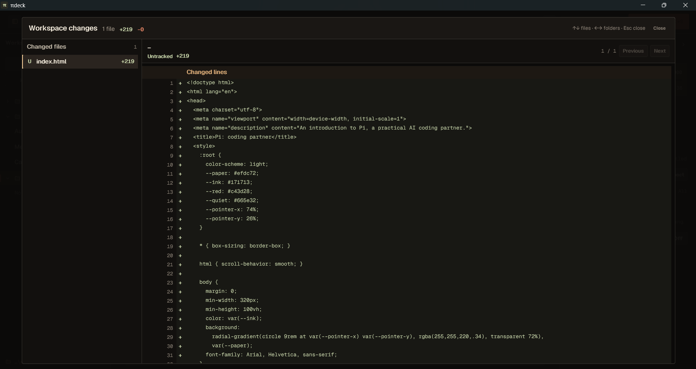
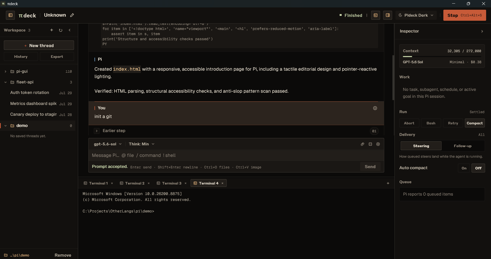

<div align="center">

# Pideck

**The desktop home for [Pi](https://github.com/earendil-works/pi)** — a native shell that turns the coding agent you already run from the terminal into a focused, keyboard-first workspace.


<br />



</div>

---

Pideck is written in **Rust** on **GPUI 0.2.2**. Pi remains the agent runtime and credential owner; Pideck discovers it, supervises it, and gives its full capability set — sessions, tools, extensions, orchestration — a polished interface.

## Screenshots

<table>
  <tr>
    <td align="center" width="50%">
      <br />
      <b>Session & sidebar</b>
    </td>
    <td align="center" width="50%">
      <br />
      <b>Themes</b>
    </td>
  </tr>
  <tr>
    <td align="center" width="50%">
      <br />
      <b>Diff viewer</b>
    </td>
    <td align="center" width="50%">
      <br />
      <b>Terminal</b>
    </td>
  </tr>
</table>

## Features

- Collapsible project sidebar with multi-thread catalogs, live background-work status, and session switch / rename / export
- Multiline composer with drag-and-drop attachments, `@` file completion, `/` command completion, and direct Bash (`!` / `!!`)
- Steer mid-run with `Enter`, queue follow-ups with `Alt+Enter`, delivery state always visible
- Streaming Markdown transcript with tool cards, expandable args, diff and image previews, copy, and elapsed time
- Read-only Git change summary with a bounded per-file diff viewer after each response
- Provider authentication, searchable model switcher, and thinking controls — Pideck never stores credentials
- Command palette (`Ctrl+Shift+P`) merging native actions with discovered extension, skill, and prompt-template commands
- Embedded PTY terminal, keyboard-first recovery (connect / retry / stop), and hotkey help (`Ctrl+/`)
- Resource Center inventory for extensions, tools, skills, prompt templates, themes, and packages
- No telemetry, no analytics, no remote reporting

## Supported extensions

Every installed Pi extension is hosted natively: `select`, `confirm`, `input`, and `editor` dialogs become native windows, status lines and widgets render in place, window titles update the title bar, and extension commands join the palette.

**First-class Inspector supervision**

| Extension | What you get |
|---|---|
| `@tintinweb/pi-tasks` | Task lists with dependencies, blockers, and outputs; guarded execute and stop |
| `@tintinweb/pi-subagents` | Live lifecycle, queue, concurrency, schedules, worktrees, and memory; steer, stop, and resume agents; conversation overlay with a bounded live transcript |
| `pi-goal` | Objective, status, budget, and elapsed time; guarded pause, resume, edit, and clear |

**Tested through the runtime**

- `ask-user-question` — multi-question flows, choices, previews, notes, and multi-select answered through native dialogs


## Requirements

| | |
|---|---|
| OS | Windows |
| Rust | 1.85+ (stable, see `rust-toolchain.toml`) |
| Pi | `@earendil-works/pi-coding-agent@0.82.1` |
| Node | Required only for Pi and the SDK bridge sidecar |

## Quick start

```powershell
npm install -g @earendil-works/pi-coding-agent@0.82.1
cargo run
```

If Cargo is not on `PATH`:

```powershell
& "$env:USERPROFILE\.cargo\bin\cargo.exe" run
```

On first launch, pick or open a project — it joins the sidebar and reopens next time. Existing Pi credentials are reused; you can also authenticate from **Settings → Providers**.

## Keyboard essentials

| Action | Keys |
|---|---|
| Command palette | `Ctrl+Shift+P` |
| Connect · Retry · Stop | `Ctrl+Alt+C` · `Ctrl+Alt+R` · `Ctrl+Alt+S` |
| Workspace terminal | `` Ctrl+` `` |
| Attach files | `Ctrl+O` or drag onto the composer |
| Send / steer · newline · queue follow-up | `Enter` · `Shift+Enter` · `Alt+Enter` |
| Direct Bash · Bash excluded from context | `!cmd` · `!!cmd` |
| Abort the active run | `Escape` |
| Hotkey help | `Ctrl+/` |

The full map lives in [info/README.md](info/README.md).

## Documentation

| Doc | Contents |
|---|---|
| [info/README.md](info/README.md) | Launch policy, keyboard map, architecture map |
| [AGENTS.md](AGENTS.md) | Conventions for contributors and coding agents |

## Development

```powershell
cargo fmt --all -- --check
cargo check --all-targets
cargo test --all-targets
```

Dev builds use `opt-level = 1` so GPUI rendering stays fluid without a full release profile; the hot rendering crates compile at `opt-level = 3`.
