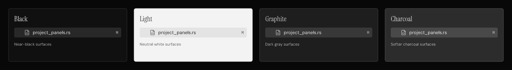

# Pideck reimagined: final design handoff

Completed editable design handoff, 2026-09-11. The package covers Files, Projects, a nested Git tree with unified and split diffs, compact layout, reusable components, and recovery states. Every screen uses Black, Light, Graphite, or Charcoal.

This is a design deliverable. Terminal output, project names, file counts, and diffs are synthetic fixtures. The Rust application has not been changed.

[Open the editable Pen document](C:/Users/devas/.pencil/documents/f92cb97a-097a-4c70-a318-9f852a1116ea/pencil-new.pen)

The editable master is saved in Pen's local documents folder at the link above. This directory contains this README and 14 refreshed PNG exports. Image filenames retain their Pen frame IDs so every export can be traced to its editable source. The encrypted master must be opened through Pen.

## Four neutral themes

| Theme | Surface | Canvas | Full Git preview |
| --- | --- | --- | --- |
| Black | Near black | `#080808` | [Black](UQs5F.png) |
| Light | Neutral white | `#FCFCFC` | [Light](GmJSh.png) |
| Graphite | Dark gray | `#171717` | [Graphite](c5tevS.png) |
| Charcoal | Softer charcoal | `#262626` | [Charcoal](x1cKs.png) |

`appearance` is the theme axis in Pen. Apply one of these four values to a screen root. All four share typography, geometry, and semantic variables. Shells, text, selections, borders, and controls use grayscale; muted red and green carry Git and error/success meaning. The rejected colored palette values have been removed from the design variables.

## Screens and supporting boards

| Frame | Preview | Design |
| --- | --- | --- |
| `G3IFh` | [Files / Black](G3IFh.png) | Explorer and running terminal, 1440 x 900 |
| `aNEkE` | [Projects / Black](aNEkE.png) | Project selection, terminal counts, and project actions, 1440 x 900 |
| `M1HaDd` | [Split diff / Light](M1HaDd.png) | Nested Git tree and side-by-side diff, 1440 x 900 |
| `f8Xso6` | [Compact workspace / Light](f8Xso6.png) | Explorer at 1024 x 720, scrolled to working files |
| `FsYkq` | [Foundations](FsYkq.png) | Tokens, component masters, focus states, and four neutral appearances, 1440 x 700 |
| `rvi4i` | [Interaction states / Black](rvi4i.png) | Refresh, folder error, rename conflict, empty filter, project removal, and Git error, 1440 x 880 |
| `m6mHmj` | [Theme comparison](m6mHmj.png) | All four neutral themes together, 1440 x 198 |

The four full Git previews above are 1440 x 900. Three additional matching canvas exports preserve existing frame links: [Black / P4Boy](P4Boy.png), [Graphite / g7AhYc](g7AhYc.png), and [Charcoal / AjK9d](AjK9d.png). All PNGs are exported at 1x.

## Shared design

- DM Sans for controls, Instrument Serif for the wordmark, IBM Plex Mono for terminal text, code, and counts.
- A 40 px titlebar, 52 px workspace toolbar, 42 px tab strip, and 28 px status bar.
- A 288 px sidebar, reduced to 256 px in the compact example. Git uses 336 px to accommodate deeper folder trees and aligned counts. Proposed resize range: 256-420 logical pixels.
- Files, Projects, and Git stay in the same position at the top of the sidebar.
- Explorer rows are 28 px high with 16 px indentation. Controls use a consistent 32 px height and 4-5 px corners.
- Filenames, file icons, disclosure arrows, and status markers have separate columns. Long filenames truncate with the extension retained; the full relative path is available on hover and keyboard focus.
- Selected, hovered, inactive-selected, and keyboard-focused rows are distinct. Focus uses an outline in addition to a selection background.
- The status bar has a stable project region and flexible workspace region. Version details and update commands belong in the status menu; a routine successful update check does not occupy a primary button.

Text, secondary text, selection, additions, deletions, and primary-button foregrounds have dedicated theme values. The `pd-onaccent` token prevents light-theme buttons from inheriting a dark-theme foreground assumption.

## Git review direction

Git combines a nested folder tree with a dedicated diff review surface. The themed Git screens use the same tree structure.

- Branch selection and changed-file filtering have separate rows, so a long branch name cannot displace the file count.
- Staged and unstaged sections expose their own counts. The sample has 4 staged and 115 unstaged files.
- Folders form a true parent/child hierarchy with disclosure arrows, folder icons, 16 px indentation, and vertical guide lines. Files appear directly under their parent folder; paths are not flattened into slash-separated section headings.
- Expanded and collapsed branches appear together in the sample. Folder counts show the total changed files beneath that folder, including hidden descendants.
- Collapse all sits beside Refresh. Collapsing a selected file's ancestor moves keyboard selection to that visible folder while the open diff remains available.
- Each change has a filename, a status letter, and a fixed-width area for additions and deletions. Status does not depend on color alone.
- The main review header shows the selected filename, relative path, state, totals, and previous/next change controls.
- Unified and split views use the same semantic diff colors and line-number geometry. The Light split-diff screen demonstrates side-by-side review.
- Open file connects the selected change to the existing editor journey.
- Large lists scroll inside the file region while the branch, filter, and footer stay fixed.

Filtering, the revised Git tree styling, split diff, and previous/next change controls are proposed UI behavior. Their presence in the design is not a claim that they already exist in the app. This pass does not add a commit, push, staging, or discard workflow.

The tree uses nested editable folder containers and shared file-row components in Pen. Keep expansion and selection keyed by section and relative path, so a file that appears in both Staged and Unstaged remains distinct. Filtering retains matching files' ancestors; clearing it restores the previous expansion and scroll state. Left/Right collapses or expands folders, and Enter opens the selected file's diff. Deep filenames truncate with their extension retained while status and line-count columns keep their positions.

## Stability and interaction contract

The existing source already loads directories off the UI thread, rejects stale directory generations, and preserves the selected path when rebuilding rows. Preserve those behaviors during implementation.

1. Refresh keeps the last valid listing, expanded folders, selected path, and scroll position. A loading indicator appears beside the folder being refreshed.
2. A folder error belongs to that folder and provides Retry. Do not replace a populated tree with a blank global error.
3. Rename errors preserve the entered text and focus. Enter submits; Escape cancels. Creation and rename use the same field and error treatment.
4. Filtering preserves folder context. Clearing the filter restores the previous browsing position. An empty folder and an empty filter result use different messages.
5. Repeated file operations are disabled while their operation is pending. Interrupted or failed operations retain a concise result and a recovery action.
6. Project selection preserves each project's active tab and panel. Removing a project names the project and explains that its terminals close while files remain on disk; changed editor files must resolve through their save flow before removal proceeds.
7. Git refresh errors keep the last successful list and diff, with a visible stale-state message. Selecting a different file must never label the previous file's diff as the new file; show loading until the matching result is ready.
8. A clean working tree says "No working changes" and retains the branch control. A non-repository project says "This folder is not a Git repository." Binary and oversized diffs explain the preview limitation and provide Open file.
9. Arrow keys navigate the tree, Left/Right collapse or expand, Enter opens, F2 renames, and F5 refreshes. Toolbar controls have labels or tooltips and keyboard focus. Existing shortcut conflicts must be checked before assigning shortcuts to the proposed filters.
10. Resize preserves the chosen sidebar width and active selection. At narrow widths, shorten the path and hide secondary shortcut text before reducing the main action or status readability. Large text and 125/150/200% scaling need native verification during implementation.
11. Transient feedback does not animate the tree's layout. Reduced-motion mode requires no movement to understand state changes.

## Validation and limits

- Exported previews are derived from editable Pen layers, not flattened image-generation concepts.
- Reviewed the screen layouts and checked visible descendants for clipping with Pen's resolved bounds. Disabled component descendants are excluded from visible-overflow checks.
- Checked six foreground/background pairs for each theme: primary text, muted text, selected text, diff additions, diff deletions, and primary-button text. Minimum ratios by theme are Black 7.14:1, Light 5.56:1, Graphite 6.46:1, and Charcoal 6.15:1. This is a token check, not a complete accessibility certification.
- Verified all 14 PNG files, their dimensions, and local README links. Every export was refreshed from the final Pen artboards; no obsolete colored-screen exports remain in this directory.
- No Rust files, dependencies, runtime settings, or Git history were changed. Cargo formatting, compilation, and tests were skipped because this pass changes design artifacts only.
- Native interaction, actual file-operation recovery, terminal behavior, scaling, and performance have not been tested by these static designs.
